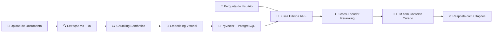

<p align="center">
  
  
  
  
  
  
</p>

<h1 align="center">🧠 JavaRAG</h1>
<p align="center">
  <strong>Ecossistema RAG de Nível Corporativo — Spring Boot + LangChain4j + Spring AI</strong>
</p>
<p align="center">
  <em>Busca Híbrida · Citações Inline · Re-ranking · Observabilidade · Multi-Provider</em>
</p>

---

## 📖 Visão Geral

O **JavaRAG** é uma implementação de referência de um sistema de **RAG (Retrieval-Augmented Generation)** de alto desempenho, construído inteiramente em Java 21. Ele demonstra como montar um pipeline de IA generativa que vai muito além do "pergunta e resposta" — com **busca híbrida RRF**, **citações verificáveis**, **re-ranking por Cross-Encoder**, **observabilidade de custos** e uma interface React moderna com feedback visual em tempo real.

> **Por que Java para RAG?**  
> Enquanto a maioria dos exemplos de RAG usa Python, o ecossistema Java empresarial (Spring Boot, JPA, Micrometer) oferece vantagens naturais para **governança**, **observabilidade**, **multi-tenancy** e **resiliência em produção** — tudo o que este projeto explora.

---

## 🧬 Como o RAG Funciona (Teoria)

RAG resolve dois problemas fundamentais dos LLMs: **alucinação** e **conhecimento desatualizado**. Em vez de confiar apenas no treino do modelo, o sistema injeta contexto real extraído dos seus documentos.



### Pipeline Detalhado

| Etapa | Descrição | Tecnologia |
|-------|-----------|------------|
| **1. Ingestão** | Documentos (PDF, DOCX, TXT) extraídos e limpos | Apache Tika 2.9.2 |
| **2. Chunking** | Divisão recursiva inteligente (1000 chars / 200 overlap) preservando parágrafos e frases | LangChain4j Splitters |
| **3. Embedding** | Conversão em vetores semânticos de alta dimensão | OpenAI `text-embedding-3-small` |
| **4. Indexação** | Armazenamento dual: PostgreSQL (metadados) + PgVector (vetores) | Spring AI PgVector Starter |
| **5. Retrieval** | Busca Híbrida: Vetorial (Dense) + Lexical (Full Text Search) unificada via **RRF** | Algoritmo Reciprocal Rank Fusion |
| **6. Reranking** | Reordenação fina dos candidatos via Cross-Encoder | Cohere `rerank-multilingual-v3.0` |
| **7. Geração** | LLM responde com contexto curado + citações inline `[n]` | OpenAI GPT-4o / Anthropic Claude |

---

## 🚀 Funcionalidades

### Core RAG
- ⚡ **Busca Híbrida com RRF** — Combina busca vetorial (Dense Retrieval) com lexical (Postgres Full Text Search) usando Reciprocal Rank Fusion
- 🎯 **Cross-Encoder Reranking** — Reordenação precisa via Cohere antes do envio ao LLM
- 📎 **Citações Verificáveis** — Respostas com referências inline `[n]` clicáveis, com visualização do documento-fonte e highlight do trecho citado
- 🔄 **Dual Framework** — Alterne entre LangChain4j e Spring AI em tempo real via toggle na UI

### Ingestão & Documentos
- 📄 **Multi-Formato** — PDF, DOCX, TXT via Apache Tika
- ⚙️ **Ingestão Assíncrona** — Processamento em background com barra de progresso em tempo real (Extraindo → Chunking → Embedding → Indexando)
- 🔬 **Inspeção de Chunks** — Visualize os chunks gerados e seus IDs de embedding diretamente na UI
- 🗑️ **Cascade Delete** — Exclusão segura de documentos com limpeza automática de chunks e embeddings no PgVector

### Chat & Histórico
- 💬 **Múltiplas Conversas** — Sidebar com histórico persistente, troca entre sessões, exclusão individual
- 🧹 **Limpar Histórico** — Apague todas as conversas de uma vez
- 📝 **Citações Persistidas** — As citações de cada resposta são salvas como JSON no banco e restauradas ao recarregar conversas

### Observabilidade & Auditoria
- 📊 **Dashboard de Métricas** — Tokens consumidos, custo estimado (USD), latência média, total de requisições
- 📋 **Audit Log** — Registro completo de cada interação: query, resposta, modelo, tempo, tokens, custo
- 📈 **Prometheus/Micrometer** — Métricas exportadas via Spring Actuator para integração com Grafana

### Configuração & Segurança
- 🔑 **Config Dinâmica** — Gerencie chaves de API e alterne provedores (OpenAI / Anthropic) em tempo real pela UI
- 🛡️ **Validação de Provider** — Provedores só podem ser ativados se possuírem API key configurada
- 🔒 **Spring Security + JWT** — Infraestrutura preparada para multi-tenancy

---

## 🛠️ Stack Tecnológica

### Backend
| Componente | Tecnologia | Versão |
|-----------|------------|--------|
| Runtime | Java (OpenJDK) | 21 |
| Framework | Spring Boot | 3.2.5 |
| AI Framework (1) | Spring AI | 1.0.0-M1 |
| AI Framework (2) | LangChain4j | 0.35.0 |
| Banco de Dados | PostgreSQL + PgVector | Latest |
| Extração de Texto | Apache Tika | 2.9.2 |
| Autenticação | Spring Security + JJWT | 0.12.5 |
| Métricas | Micrometer + Prometheus | — |
| Build | Maven + Lombok | 1.18.46 |

### Frontend
| Componente | Tecnologia | Versão |
|-----------|------------|--------|
| Framework | React | 19 |
| Bundler | Vite | 8.x |
| Estilo | Tailwind CSS | 4.x |
| Animações | Framer Motion | 12.x |
| Ícones | Lucide React | 1.x |
| Markdown | React Markdown + remark-gfm | — |
| Syntax Highlight | react-syntax-highlighter (VSC Dark+) | 16.x |
| HTTP Client | Axios | 1.x |

### Infraestrutura
| Componente | Tecnologia |
|-----------|------------|
| Container DB | `ankane/pgvector:latest` via Docker Compose |
| Vector Store | PgVector (Spring AI Starter) |

---

## 📂 Arquitetura de Serviços

```
src/main/java/com/jdeveloperweb/javarag/
├── api/                          # REST Controllers
│   ├── AuditLogController        → GET /api/v1/audit
│   ├── ChatController            → POST /api/v1/chat/query, GET /conversations
│   ├── ConfigController          → GET/POST /api/v1/config
│   ├── DocumentController        → CRUD /api/v1/documents
│   ├── IngestionController       → POST /api/v1/ingestion/upload
│   └── GlobalExceptionHandler    → Tratamento centralizado de erros
├── model/                        # JPA Entities
│   ├── AuditLog                  → Registro de auditoria (query, resposta, tokens, custo)
│   ├── ChatMessage               → Mensagem com campo citationsJson (TEXT)
│   ├── Chunk                     → Pedaço de documento + embedding ID
│   ├── Conversation              → Sessão de chat
│   ├── Document                  → Documento com status de ingestão e progress tracking
│   ├── IngestionJob              → Job de ingestão assíncrona
│   └── ModelProviderConfig       → Config de provedor (API key, modelo, ativo?)
├── service/                      # Lógica de Negócio
│   ├── ChatService               → Orquestra prompt + LLM (LangChain4j)
│   ├── SpringAiChatService       → Orquestra prompt + LLM (Spring AI)
│   ├── IngestionService          → Pipeline assíncrono: chunk → embed → index
│   ├── RetrievalService          → Busca Híbrida (Vetorial + Lexical) + RRF
│   ├── RerankingService          → Cross-Encoder via Cohere
│   ├── ModelService              → Factory dinâmica de modelos por provider
│   ├── TikaService               → Extração de texto multi-formato
│   ├── TokenCostService          → Cálculo de custo por token/modelo
│   ├── MetricsService            → Contadores Micrometer (tokens, custo)
│   └── ConversationService       → CRUD de conversas
└── config/                       # Configurações Spring
```

```
web-ui/src/components/
├── ChatView.tsx           → Chat com sidebar de histórico, citações clicáveis, viewer de documento
├── IngestionView.tsx      → Upload, progresso em tempo real, inspeção de chunks
├── ConfigView.tsx         → Gerência de provedores (OpenAI, Anthropic, Cohere)
├── AuditLogView.tsx       → Visualização de logs de auditoria
└── ObservabilityView.tsx  → Dashboard de métricas (tokens, custo, latência)
```

---

## ⚙️ Instalação e Configuração

### Pré-requisitos

- ☕ **Java 21** (OpenJDK recomendado)
- 🐳 **Docker** e **Docker Compose**
- 📦 **Node.js 20+** e **npm**

### Quick Start

```bash
# 1. Clone o repositório
git clone https://github.com/jdeveloperweb/javaRAG.git
cd javaRAG

# 2. Suba o PostgreSQL com PgVector
docker-compose up -d

# 3. Execute o Backend
./mvnw spring-boot:run

# 4. Execute o Frontend (em outro terminal)
cd web-ui
npm install
npm run dev
```

### Configuração Inicial

1. Acesse `http://localhost:5173` no navegador
2. Navegue até a aba **Configuração**
3. Insira sua **API Key** da OpenAI e/ou Anthropic
4. Ative o provedor desejado como padrão
5. Pronto! Faça upload de documentos na aba **Library** e comece a conversar

> **💡 Dica**: As chaves de API são armazenadas de forma segura no PostgreSQL — não é necessário configurar variáveis de ambiente para os provedores de IA.

---

## 📝 System Prompt (Estratégia de Resposta)

O sistema utiliza um **System Prompt** rigoroso que instrui o LLM a:

1. ✅ Responder **apenas** com base no contexto recuperado
2. 📎 Citar fontes usando marcadores inline `[n]`
3. 🚫 Admitir quando **não possui** a informação (anti-alucinação)
4. 📚 Listar a **"Base Consultada"** ao final de cada resposta

---

## 🧪 Testes

O projeto implementa uma estratégia de **TDD** com testes unitários para os serviços core:

```bash
# Executar todos os testes
./mvnw test
```

| Teste | Cobertura |
|-------|-----------|
| `TikaServiceTest` | Extração de texto multi-formato |
| `TokenCostServiceTest` | Cálculo de custo por modelo/token |
| `MetricsServiceTest` | Contadores Micrometer |

---

## ✨ Changelog Recente

### 🔒 Validação de Ativação de Provider
- Provedores (Claude/OpenAI) agora **só podem ser ativados** se possuírem API Key configurada
- Botões de provider no chat ficam desabilitados quando sem chave, prevenindo erros de runtime

### 📎 Citações Persistidas no Banco
- Campo `citationsJson` (TEXT) adicionado à entidade `ChatMessage`
- Citações são serializadas como JSON ao salvar e deserializadas ao carregar histórico
- Citações sobrevivem a recarregamentos de página e troca de conversas

### 🔍 Correções no Viewer de Citações
- Documentos legados sem `extractedText` tratados graciosamente
- Funcionalidade de **highlight + scroll automático** para o trecho citado no documento completo

### 🧪 Cobertura de Testes (TDD)
- Implementados testes unitários para `TikaService`, `TokenCostService` e `MetricsService`
- Estratégia de TDD estabelecida para novos serviços

### 🔄 Correção de Ingestão Duplicada
- Resolvido bug de disparo múltiplo no pipeline assíncrono que causava tarefas redundantes
- Processamento agora executa uma única vez por documento

### 📊 Observabilidade & Audit Log
- Dashboard de métricas com tokens, custo estimado, latência média e total de requisições
- Audit log com rastreamento completo de cada interação no frontend
- Métricas Prometheus via Micrometer (`llm.tokens.prompt`, `llm.tokens.completion`, `llm.cost`)

### 🛡️ Estabilidade & Resiliência
- Correção de `StackOverflowError` por recursão Hibernate (Jackson + `@JsonIgnore`)
- Tratamento de `Foreign Key Constraint` na deleção de documentos (cascade delete)
- `GlobalExceptionHandler` para erros REST centralizados
- Skeleton loading, modais animados (Framer Motion) e notificações toast na UI

### 🧹 Limpeza de Dependências
- Cohere removido como provedor de **chat** (mantido apenas para **reranking**)
- Correção de compilação (Lombok 1.18.46 + Maven Compiler 3.13.0 para Java 21)

---

## 🚧 Roadmap

| Prioridade | Feature | Descrição |
|:----------:|---------|-----------|
| 🔴 | **Evaluation Framework** | Testes automatizados de qualidade de resposta (RAGAS) |
| 🔴 | **Streaming Response** | Respostas em tempo real via SSE/WebSocket |
| 🟡 | **LlamaParse / Unstructured** | Parsers avançados com leitura inteligente de tabelas e OCR |
| 🟡 | **Grafana Dashboard** | Integração visual com métricas Prometheus |
| 🟢 | **Multi-tenancy Completo** | Isolamento de dados por tenant com JWT |
| 🟢 | **Query Rewriting** | Reformulação automática de perguntas para melhor retrieval |

---

## 🤝 Contribuições

Sinta-se à vontade para abrir **Issues** ou enviar **Pull Requests**.  
Este projeto foi feito para a comunidade Java explorar as fronteiras da IA Generativa!

---

<p align="center">
  <strong>Desenvolvido por <a href="https://github.com/jdeveloperweb">Jaime Vicente</a></strong>
</p>
